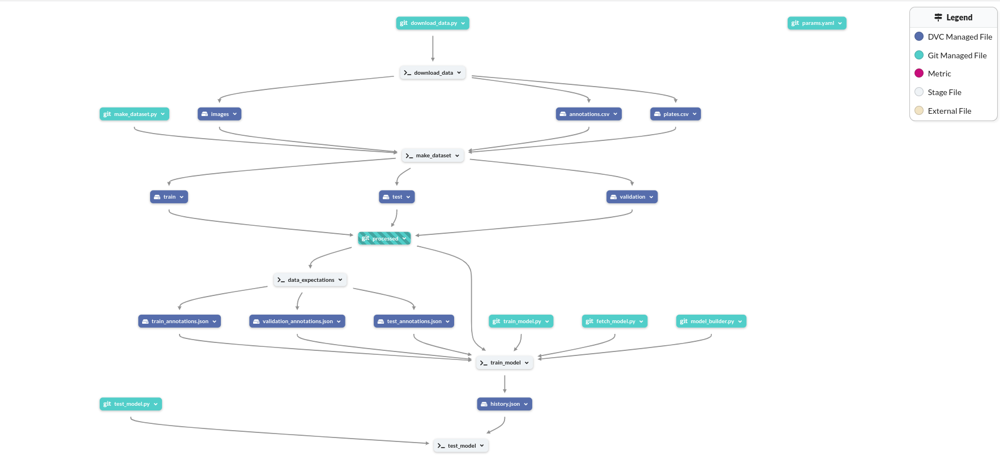
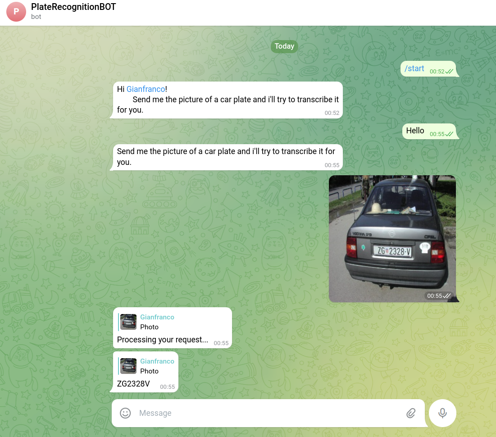
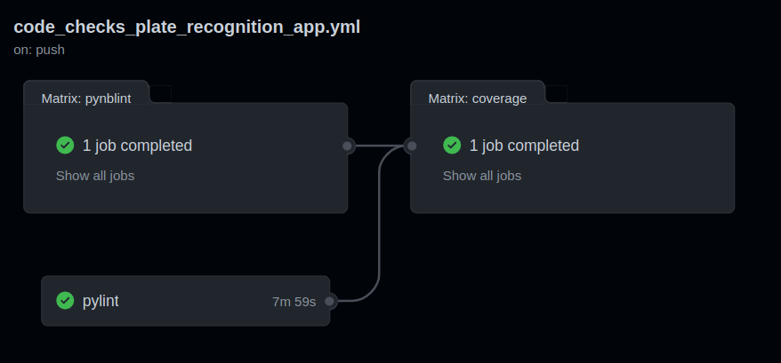
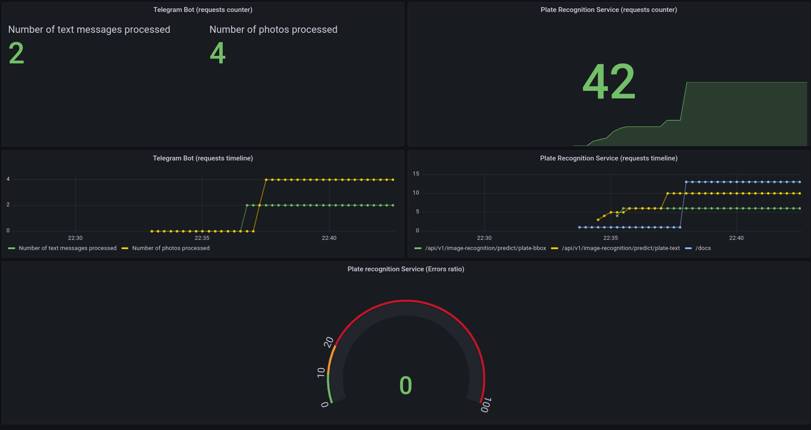

[](https://github.com/gianfrancodemarco/plate-recognition/actions/workflows/code_checks_plate_recognition_app.yml)
[](https://plate-recognition-qbly4ubf5q-uc.a.run.app/docs#/)
[](https://t.me/PlateRecognitionBOT)
[](https://prometheus-qbly4ubf5q-uc.a.run.app)
[](https://grafana-qbly4ubf5q-uc.a.run.app)

## Table of Contents
1. [The project](#the-project)
2. [Inception](#inception)
    1. [Git Flow](#git-flow)
    2. [Project Organization](#project-organization)
    3. [Model card](#model-card)
    4. [Dataset card](#dataset-card)
3.  [Reproducibility](#reproducibility)
    1. [Dagshub](#dagshub)
    2. [DVC](#dvc)
        1. [Pipelines](#pipelines)
    3. [MLFlow](#mlflow)
    4. [Random Number Generator](#random-number-generator)
    5. [.env](#env)
    6. [Github variables and Secrets](#github-variables-and-secrets)
4. [Quality assurance](#quality-assurance)
    1. [Pylint](#pylint)
    2. [Pynblint](#pynblint)
    3. [Pytest and coverage](#pytest-and-coverage)
    4. [Great Expectations](#great-expectations)   
5. [API](#api)
6. [Telegram Bot](#telegram-bot)
7. [CI/CD](#cicd)
    1. [Code Checks](#code-checks)
    2. [DockerHub](#dockerhub)
    3. [Deployments](#deployments)
8. [Monitoring](#monitoring)
    1. [Prometheus](#prometheus)
    2. [Grafana](#grafana)
9. [Extra](#extra)
    1. [Hyperparameters optimization](#hyperparameters-optimization)
    2. [Data augmentation](#data-augmentation)
    3. [Project structure](#project-structure)
    4. [Security](#security)
    5. [Developer Guide](#developer-guide)
        1. [docker-compose](#docker-compose) (PIP CACHE)


# The project
This project aims to build a service that recognizes and transcribes the license plate of a vehicle from a picture.
The service is composed of:
- A [backend service](https://plate-recognition-qbly4ubf5q-uc.a.run.app/docs#/), which exposes the API that interact with the model
- A [backend service](https://telegram-bot-qbly4ubf5q-uc.a.run.app/) which is connected to a [Telegram bot](https://t.me/PlateRecognitionBOT), that can be used from the users to interact with the service
- A [Prometheus instance](https://prometheus-qbly4ubf5q-uc.a.run.app), for metrics collection
- A [Grafana instance](https://grafana-qbly4ubf5q-uc.a.run.app), for monitoring and data analysis

The plate recognition is performed in two steps:
- plate detection: uses a custom model to find the bounding box of the plate 
- image-to-text: uses a pretrained model to transcribe the plate

# Inception

## Git Flow

The Git workflow has been organized in a simple flow.
3 branches are maintaned:
- `dev`, which is used to track features in development
- `main` (default), where the features are merged when complete
- `production`, used to deploy the services with CI/CD integrations

## Project Organization

The project initial organization has been created using the [cookiecutter data sicence template](https://drivendata.github.io/cookiecutter-data-science/) and then adapted to the needs of this projects.
For example, the folder `src/pipeline` has been added to gather all of the scripts composing the dvc pipeline.
Another example is the absence of the `model` folder, since this project is completely integrated with MLFlow and uses an the MLFlow server provided by Dagshub to store the models.

```
📦plate-recognition
 ┣ 📂.github
 ┃ ┗ 📂workflows            <- Workflow to be run on Github actions
 ┣ 📂data                    
 ┃ ┣ 📂external             <- Data from third party sources.
 ┃ ┣ 📂interim              <- Intermediate data that has been transformed.
 ┃ ┣ 📂processed            <- The final, canonical data sets for modeling.
 ┃ ┗ 📂raw                  <- The original, immutable data dump.
 ┣ 📂grafana
 ┣ 📂notebooks              <- Jupyter notebooks. Naming convention is a number (for ordering),
 ┃                              the creator's initials, and a short `-` delimited description, e.g.
 ┃                              `1.0-jqp-initial-data-exploration`.
 ┣ 📂prometheus             <- Custom Docker image for prometheus
 ┣ 📂references             <- Data dictionaries, manuals, and all other explanatory materials.
 ┣ 📂reports                <- Generated analysis as HTML, PDF, LaTeX, etc.
 ┃ ┣ 📂figures              <- Generated graphics and figures to be used in reporting
 ┃ ┣ 📂great_expectations
 ┃ ┣ 📂train
 ┣ 📂src                    <- Source code for use in this project.
 ┃ ┣ 📂app                     <- Source code for the APIs    
 ┃ ┃ ┣ 📂api
 ┃ ┣ 📂bot                     <- Source code for the Telegram Bot           
 ┃ ┣ 📂data                    <- Scripts to download or generate data
 ┃ ┣ 📂features                <- Scripts to turn raw data into features for modeling
 ┃ ┣ 📂models                  <- Scripts to train models and then use trained models to make predictions
 ┃ ┣ 📂pipeline                <- Script composing the experiment pipeline
 ┃ ┣ 📂visualization           <- Scripts to create exploratory and results oriented visualizations
 ┃ ┣ 📜logging.conf            <- Logging configuration
 ┣ 📂tests                  <- Python tests
 ┣ 📜.coverage
 ┣ 📜.dockerignore
 ┣ 📜.dvcignore
 ┣ 📜.gitignore
 ┣ 📜.pylintrc
 ┣ 📜Dockerfile_app         <- Dockerfile for the APIs
 ┣ 📜Dockerfile_bot         <- Dockerfile for the Telegram Bot
 ┣ 📜LICENSE
 ┣ 📜README.md
 ┣ 📜dev-requirements.txt
 ┣ 📜docker-compose.yaml    <- Docker compose file for local developement
 ┣ 📜dvc.lock
 ┣ 📜dvc.yaml
 ┣ 📜example.env            <- Example environment file
 ┣ 📜locustfile.py          <- Locust source code for load testing
 ┣ 📜params.yaml
 ┣ 📜requirements_app.txt
 ┣ 📜requirements_bot.txt
 ┣ 📜setup.py               <- makes project pip installable (pip install -e .) so src can be imported
 ┗ 📜tox.ini
```

## Model card

Describe the 2 models!

## Dataset card
# Reproducibility

## Dagshub

Dagshub is a Github's inspired platform, specifically created for data science projects, that allows to host, version, and manage code, data, models, experiments,
Dagshub is free and open-source. Furthermore, reaching out to the mantainers on their discord server, it is possible to obtain a free pro license, accorded to students.

Dagshub comes with a DVC remote storage (100GB for pro accounts) and a remote MLFlow server.


## DVC

DVC is a software, based on Git, that allows to version data and track data science experiments.

In this project, the contents of the `data` folder is stored and tracked using 
DVC.
The remote storage used is the one offered by Dagshub.

### Pipelines

DVC allows not only to version data, but also to create fully reproducible pipelines.
The pipelines are defined using the CLI or by manually editing the `dvc.yaml` file.

A pipelines of 5 steps has been defined:
- `download_data`: downloads the raw data from an external source
- `make_dataset`: reorganizes the raw data in a viable datasets, then splits the data in train, validation and test sets
- `data_expectations`: checks the structure of the data. This project is based on image data, which find no support from GreatExpectations. For this reason, only the annotations have been checked.
- `train_model`: trains the model, tracking the experiment and the artifacts on the remote MLFlow server
- `test_model`: tests the model on the test set and stores the results on the remote MLFlow server 

\
\


The pipeline can be configured using the `params.yaml` file.
This file contains configurations for the structure of the model, the training and the testing phases.


### MLFlow

MLFLow is a software that allows to track Machine Learning experiments and models.
It stores the metrics of the experiments, allowing the developer to compare different models and parameters. Also, allows to store the models and retrieve them when needed.

This project is fully integrated with MLFlow:
- for the training and testing phase, experiments and models are trackend on the Dagshub's MLFlow server
- the API service loads the image detection model directly from Dagshub.

For this integration, the following environment variables are required to be set:

- MLFLOW_TRACKING_URI
- MLFLOW_TRACKING_USERNAME
- MLFLOW_TRACKING_PASSWORD

How to set these variables in dev and production environment is described in the next sections.

### Random number generator

In a data science project, it is not rare to rely on randomness to perform some tasks: dataset splitting in different sets, Neural Networks weight initialization, etc.
This puts a threath for the experiments reproducibility, since even if the developer doesn't perform any change in the proejct, some internal mechanisms will behave slightly different from one run to another.
To overcome this issue, it is a good practice to fix the seeds for the random generators used by the project.

For this project, this is done by the function `set_random_states` in `src/utils.py`, which is called at appropriate spots.
Moreover, the random state which is set can be changed in the `params.yaml` file.


### .env

It is a good practice to not place in the source code all of those configurations that can change in time, differ by environment, or that need to be classified.
For local environments, this is usually done using env files.

In these project, the `.env` file is read at the startup by the program, so that all of the environment variables are accessible by the code.
This file **MUST NOT** be added to version control (Git) or docker images, as it may contain API Tokens or passwords.
For this reason, when the services are executed in the context of `docker-compose`, the `.env` file is externally mounted into the services.


### Github variables and secrets

Since the `.env` file is not added to version control, these values must be stored somewhere to be accessible to the CI.

This is done using Github's:
- environment variables: here are stored all of those configuration which are not reserved, such as paths configurations. These are kept in clear
- secrets: here are stored all of the sensible configurations, like passwords and tokens. There are encrypted

The following have been defined:

**Environment variables**
- APP_DOCKER_IMAGE
- APP_SERVICE_NAME
- BOT_DOCKER_IMAGE
- BOT_SERVICE_NAME
- GRAFANA_DOCKER_IMAGE
- GRAFANA_SERVICE_NAME
- MODEL_NAME
- MODEL_VERSION
- PLATE_RECOGNITION_APP_HOST
- PLATE_RECOGNITION_APP_PORT
- PLATE_RECOGNITION_APP_SCHEMA
- PROMETHEUS_DOCKER_IMAGE
- PROMETHEUS_HOST
- PROMETHEUS_PORT
- PROMETHEUS_SCHEMA
- PROMETHEUS_SERVICE_NAME
- TELEGRAM_BOT_HOST
- TR_OCR_MODEL
- TR_OCR_PROCESSOR

**Secrets**
- CLOUD_RUN_JSON_KEY
- DAGSHUB_TOKEN
- DAGSHUB_USERNAME
- DOCKERHUB_TOKEN
- DOCKERHUB_USERNAME
- GAR_JSON_KEY
- MLFLOW_TRACKING_PASSWORD
- MLFLOW_TRACKING_URI
- MLFLOW_TRACKING_USERNAME
- TELEGRAM_API_TOKEN

# Quality assurance

## Pylint

This project integrates pylint, which is a static code analyser for Python, which checks the quality of the source code.

## Pynblint

This project integrates pynblint, which is a static code analyser for Python notebooks.

## Pytest and coverage

This project integrates pytest and coverage for unit testing of the code.
Pytest is a framework that allows to write and execute unit tests.

Coverage can be used as a wrapper for pytest, and is useful to produce statistics about the testing of the code (files/lines coverage).

## Great Expectations

Great expectations is a library that allows to check for the quality and charateristichs of the data. Specifically, it is useful to detect changes in the characteristics of the data in time.

Great expectations is mainly indicated for tabular data. Since this project is based mainly on image data, Great expectations has been used exclusively to test the images annotations.

# API

The plate recognition service is exposed using an HTTP server.
The framework used to build the APIs is FastAPI.

The service loads the two required models at startup:
- the plate recognition model (custom) from MLflow
- the image-to-text model (pre trained) from HuggingFace

The API exposed are:
```
URL: /api/v1/image-recognition/predict/plate-bbox
Body: 
- image_file (Binary)
Parameters:
- as_image (boolean)
    
Predicts the bbox of the plate for an image.
If as_image is true, it returns the original image with the bbox drawn in overlay; otherwise, it returns the array representing the bbox.
```

```
URL: /api/v1/image-recognition/predict/plate-text
Body: 
- image_file (Binary)
Parameters:
- postprocess (boolean)
    
Predicts the plate for an image.
If postprocess is true, it applies some postprocessing to the predicted plate.
```

# Telegram bot

The frontend chosen for these project is a Telegram Bot.
Telegram bots are user friendly and easy-to-setup solutions to provide interfaces for a service.

The telegram bot for this project can be found [here](https://t.me/PlateRecognitionBOT).

The user can send here an image, and the bot will respond with the predicted place.

The telegram bot backend is a stand-alone service, and sends an HTTP request to the `/api/v1/image-recognition/predict/plate-text` to predict the license plate.

It always uses the `postprocess` parameter as true.



# CI/CD

Continuous Integration & Continuous Deployment are foundamental aspects of modern software engineering.

This concepts are extensively integrated into this project through the mean of Github Actions.
Github Actions allow to define workflows, which are pieces of codes that can be executed remotely as responses to some event happening on the repository (push, pull requests, other workflows completing...)

Some general concepts that are valid along all of the workflows in this project:
- workflows are configured so that they are executed only when necessary; e.g. the build & deployment of the Grafana service is run only when code regarding Grafana is changed;
- all of the relevant values used in the workflows are retrieved by Github Environment Variables (when these are not classified values) or Github secrets.


## Code checks

The workflow `Code Checks - Plate Recognition App` is run each time changes are made to the source code.



It executes:
- static code analysis with pynbilint and pylint;
- only if the previous are successful, unit tests with coverage and pytest


## Dockerhub

Only if the `Code Checks - Plate Recognition App` workflow is executed successfully, another workflow is triggered, whick builds the docker image for the APIs and pushes it to Dockerhub.
This image was meant to be used for the deployments, but was abandoned as described in the next sections.

## Deployments

For each of the 4 services composing this project (APIs, Telegram bot backend, Prometheus and Grafana) a specific deployment workflow is configured.
These are triggered only when updates are made on the relevant code for each service, and only for the `production` branch.

The cloud platform chosen for deploying the services is Google Cloud Platform (GCP), and the specific service is Cloud Run.
Cloud Run needs the docker images for the services to run to be stored into another GCP service, Artifact Registry.
For this reason, each deployment workflow first builds the corresponding docker image and pushes it to Artifact Registry, and the triggers the deploy on Cloud Run.

For the API service, after the image has been built, load testing is conducted using the Locust library.

# Monitoring

The monitoring phase is essential in the philosofy of Continuous Deployment.

## Prometheus

Prometheus is a service that allows to retrieve metrics from running services. These metrics can then be analyzed or organized for visualization and monitoring.

In this project, Prometheus is employed on the:
- API service, retrieving default metrics
- Telegram bot backend, with two custom metrics, keeping track of the number of text messages and the number of images sent to the bot.

Prometheus does not support dynamic resolution of targets, which means that URLs must be hard-coded into the configuration.
Since this goes against the guide lines of this projects (all of the variables must be retrieved from Github), a custom Prometheus docker image has been built.
This image includes a script that is run at startup, which resolves the targets using environment variables; this environment variables can be injected by the deployment service (Github Actions & Cloud Run, docker-compose).

## Grafana

Grafana is an open source analytics & monitoring solution which can be connected to a lot of data sources. 
It allows to create dashboard and alerts based on metrics updated in near real-time.

For this project, a Grafana instance is used to build dashboards on top of the Prometheus data.

Since Cloud Run does not support mounting external storages (the containers are ephemeral), a custom Grafana docker image has been built. This image uses the [Grafana provisioning funcionality](https://grafana.com/docs/grafana/latest/administration/provisioning/) so that the service comes up with the necessary data sources and dashboard already configured.

The Grafana image comes with a default account (admin:admin) and a configured dashboard (Services -> Monitoring).




From left to right, from top to bottom:

1. Number of text messages and image messages sent to the telegram bot
2. Number of requests made to the APIs
3. Timeline of the requests made to the telegram bot
4. Timeline of the requests made to the APIs
5. Percentage of requests to the APIs which resulted in an error


# Extra 

## Hyperparameters optimization

The model architecture chosen for the plate detection model is a CNN.
Other details of the network, like the number of convolutional blocks, optimizer, learning rate etc. have been made dynamically configurable.

To find candidates for the optimal hyperparamters set, the [Optuna framework](https://optuna.readthedocs.io/en/stable/index.html) has been employed.
Optuna allows to define a distribution for each parameter that we want to optimize, then it tries different samples from these distrubution to fit the model, trying to optimize the chosen metric. 
A pruner can also be configured to prune experiments when certain criterias are not matched.
Optuna allowed to test thousands of configurations effortlessly.
After the optimization step, the best configuration were reused to conduct the full training.

## Data augmentation

The dataset used to train the plate recognition model is very small and suffers of very small diversity.
For this reason, the [Albumentations](https://albumentations.ai/) library has been utilized to augment the images.
This library offers dozens of functions that apply transformations to the input image (scaling, cropping, inserting shadows...).
A composition of transformations can be defined, each with an associated probability. Then, these trasformations are applied to the image with respect to their probability.
Tests were conducted both without and with data augmentation (see [Hyperparameters optimization](#hyperparameters-optimization)), and they showed that the augmentation clearly improves the performance of the model.
Augmentation is applied online, which means that during the traning phase, at the moment of retrieving an image to input the model, the augmentation function is applied.

## Project structure

This project has all been condensed in a single repository for sake of simplicity.
However, to ensure better maintainability and software engineering, it should be divded in:
- API service repository
- Telegram bot backend repository
- Library repository: this should contain all of the shared code and published as a pip package
- Experiments repository

## Security

Security was deliberately overlooked during this project; however, in a real-world scenario, different adjustments should be made:
- don't expose the APIs on the internet and make the accessible only from the Telegram Bot backend
- setup correct authentication for the Prometheus and Grafana instance
- setup an API limit mechanism to avoid abuses
- ...

## Developer Guide

This project is organized in a way that it is fully reproducible.

For a fresh new installation, you need to:

- clone this repository
- create a python virtual environment (strongly suggested)
- install the project requirements
- create a `.env` file, starting from the `example.env` file, and replace all of the values

To run new experiments it is sufficient to run the `dvc repro` command.
To perform hyperparameters optimization, the script to run is `src/models/hyperparameters_tuning.py`.

Finally, to spin-up all of the services on your machine, it is sufficient to run the command `docker-compose up` (this needs Docker to be installed on the system).

To setup the GCP environment, the steps described in the `terraform.txt` file are required.
