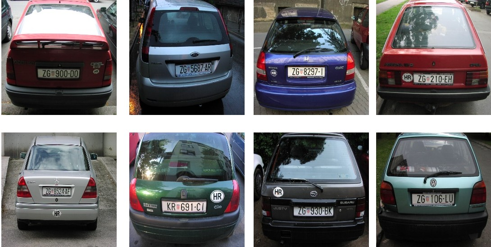

# Dataset Card for Plate Recognition dataset

## Dataset Description

- **Original dataset**: http://www.zemris.fer.hr/projects/LicensePlates/english/Diplomski/srebric-diplomski.pdf
- **Homepage:** https://drive.google.com/uc?id=1bTxEOmOtIzHPV8N43ZnJTyVu7lonIP1o&export=download
- **Point of Contact:** gianfrademarco@gmail.com, g.demarco26@studenti.uniba.it

### Dataset Summary
The dataset is a subset of the original [License Plate Detection, Recognition and Automated Storage](http://www.zemris.fer.hr/projects/LicensePlates/english/) dataset, composed of vehicle's images, focused on the license plates.

The images in the original dataset have been manually tagged with the bounding box of the vehicle plate and with the textual transcription of the plates.

### Supported Tasks and Leaderboards

The tasks supported by this dataset are:
- object detection (of the plates)
- image-to-text (transcription of the plates)  

### Languages

The images capture license plates in Latin Alphabet.

## Dataset Structure

### Data Instances

The dataset is composed of 433 images of vehicle's license plates.
The images are 256x256 pixels.
Most of the pictures are taken in similar settings: from the back of the vehicle, with natural light and with the plate in the bottom half of the image.
Most of the images contain cars; a small fraction represent trucks.

### Data Fields

For every image, the file `annotations.csv` contains the bounding box of the plate in *pascal voc* format (`xmin, ymin, xmax, ymax`).

For every image, the file `plates.csv` containes the transcription of the vehicle's plate.

### Data splits

The dataset comprehends one split of data.

## Dataset Creation

### Source Data

The source data is the [License Plate Detection, Recognition and Automated Storage](http://www.zemris.fer.hr/projects/LicensePlates/english/) dataset.

#### Initial Data Collection and Normalization

The data has been downloaded from the original source. The images were resized into the `256x256 pixels` dimension. 
The original data was split across several folders; it was merged into a single `images` folder.

### Annotations

#### Annotation process

The bounding boxes were annotated using [makesense.ai](https://www.makesense.ai/).

The plates were transcribed by hand.

#### Who are the annotators?

Gianfranco Demarco: g.demarco26@studenti.uniba.it; gianfrademarco@gmail.com

### Personal and Sensitive Information

The dataset comprehends images and transcription of vehicle license plate, which according to [GDPR](http://www.privacylegal.eu/personaldata.html) are classified as personal data.

## Considerations for Using the Data

### Social Impact of Dataset

The dataset can be build to automatically collect license plates, which is a form of personal data.

### Discussion of Biases

The pictures capture license plates in very similar settings, with low variance of position and brightness.
The license plates often contain symbols between the letters.

## Additional Information

### Dataset Curators

The curator of the original dataset can be found [here](#http://www.zemris.fer.hr/projects/LicensePlates/english/suradnici_e.shtml).

Their publication is [here](http://www.zemris.fer.hr/projects/LicensePlates/english/Diplomski/srebric-diplomski.pdf).

The curator for this version of dataset is Gianfranco Demarco.
